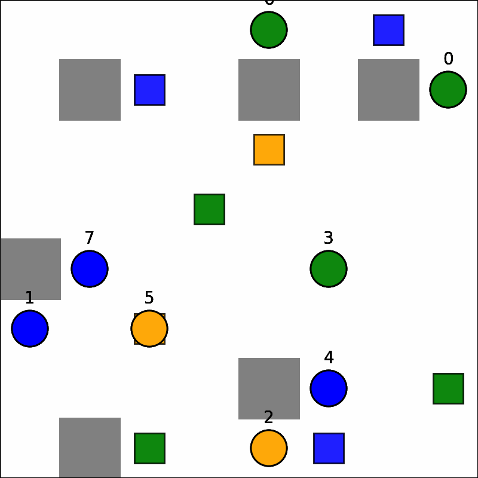

# Multi-Agent Path Finding - Improved Conflict Based Search

Improved CBS (ICBS) is an extension of the Conflict Based Search algorithm developed for the purpose of finding optimal paths for multiple agents on any given map without collisions. ICBS was presented as an extension of CBS at the IJCAI-15 Conference which incorporates several previously found improvements to CBS to accumulate their benefits.[^1] The algorithm has many practical applications, especially in the field of autonomous robotics.

## About Our Project

In our version of improved CBS, we include an additional improvement to ICBS regarding the method in which collision-based constraints are created. A promising, new method for CBS-based MAPF has emerged called _disjoint splitting_ which was published in May of this year (2021).[^2] Our goal was to combine the established improvements of ICBS with the up-and-coming method of constraint generation. Please see <a href="#background"><strong>Background</strong></a> below or our more detailed [report](final_report.pdf) on the subject for more information.

<!--  -->


_Animation Program for MAPF provided by EAAI, please refer to acknowledgements_

## Installation & Usage

### Dependencies

Use dependency manager pipenv

```bash
pipenv install --dev
```

### Running the Program

Within the `code` directory...

```bash
cd code
python3 run_experiments.py [--instance <path>] [--hlsolver <solver>] [--disjoint] [--batch]
```

The flags

- `--disjoint` CBS will use _disjoint splitting_ rather than the default _standard splitting_
- `--batch` will run all instances available in `code/instances`

The following are options for the high level algorithm `--hlsolver`

- `CBS` the original CBS algorithm
- `CBS_CB` version of CBS with Prioritizing and Bypassing Conflicts
- `ICBS` Improved CBS with all improvements

To use the `test_1.txt` instance available in `code/instances` with ICBS with disjoint splitting...

```bash
python3 run_experiments.py --instance "instances/test_1.txt" --disjoint --hlsolver ICBS
```

Place your map as a txt file in the `code/instances` folder to test your own instances.

Example: `instances/test_1.txt`

```bash
4 7
@ @ @ @ @ @ @
@ . . . . . @
@ @ @ . @ @ @
@ @ @ @ @ @ @
2
1 1 1 5
1 2 1 4
```

Explanation

1. The first line represents the number of rows and columns

```bash
4 7 (rows columns)
@ @ @ @ @ @ @
@ . . . . . @
@ @ @ . @ @ @
@ @ @ @ @ @ @
2
1 1 1 5
1 2 1 4
```

2. Followed by a map where `@` are obsticles and `.` are traversable cells

```bash
@ @ @ @ @ @ @
@ . . . . . @
@ @ @ . @ @ @
@ @ @ @ @ @ @
```

3. The next line represents the number of agents on the map

```bash
2
```

4. Finally, we list the start and end coordinates on the map for each agent separated by a new line. For example, the first agent must travel from (1, 1) to (1, 5) on the map and the second agent must travel from (1, 2) to (1, 4). This will be represented as `1 1 1 5` and `1 2 1 4` respectively.

```bash
1 1 1 5
1 2 1 4
```

<a name="background"></a>

## Background - CBS

Originally developed by a dedicated team of MAPF researchers at the AAAI Association, Conflict Based Search (CBS) is a two-level algorithm that guarantees optimal paths for each agent in a map internally represented as a graph. At the higher-level, CBS generates a constraint tree (CT) and conducts a search on the tree based on conflicts between agents. At the lower-level, a search is conducted to find an optimal path for an agent with a set of given constraints. The low-level search is typically conducted by a variant of the A\* algorithm.

CBS resolves conflicts by generating constraints for the agents involved in the collision. For any specific collision, constraints may be generated for the paths of agents involved, to prevent the collision from occurring. Each node on the CT maintains a set of constraints from any previous collisions found by its predecessors and a set of paths consistent with the current set of constraints. Given the paths, a new conflict can be chosen to be resolved with additional constraints. Therefore, each node generated in the CT aims to resolve a specific conflict found in its current set of paths until an optimal set of collision-free paths is found, concluding our search.[^3]

## Improvements to CBS

#### Prioritizing and Bypassing Conflits

When choosing a conflict to resolve, the priority in which conflicts are chosen should be determined by whether it increases the cost of the solution. A conflict _C_ may be classified as a _cardinal_, _semi-cardinal_ or _non-cardinal_ conflict. If as a result of the conflict, the length of the paths for both agents increase, _C_ is a cardinal conflict. If only one of the agent's paths increases, _C_ is a semi-cardinal conflict, and if neither paths increase it is considered non-cardinal.[^1]

If the conflict _C_ is not cardinal, there is a chance that the paths generated by one of the child nodes could replace the solution in the current node without needing to generate all the child nodes. If one of the child nodes can successfully avoid conflict _C_ without increasing the cost of the paths or introducing more conflicts than the current node, the current conflict _C_ can be _bypassed_, therefore reducing the size of the CT.[^4]

#### Meta-Agents with Merge and Restart

Although, CBS is typically much more efficient than if its lower-level counterpart A\* were to search without high-level guidance, there are some instances where using CBS is less efficient. If collisions occur often in a pair, or a small group, of agents, it becomes more efficient for the lower-level algorithm to search their paths as a group of agents, called the _meta-agent_. In Meta-Agent CBS, frequently conflicting agents are merged into a new meta-agent if the number of collisions is above a threshold, _B_, for MA-CBS(_B_).[^5]

To prevent repeated merging of the highly conflicting agents elsewhere in the CT, when a merge occurs at node _N_, the current CT is discarded and the search restarts with node _N_ as the root node. This procedure is called _Merge and Restart_.[^1]

#### Disjoint Splitting with CBS

The standard method of 'splitting' a conflict into constraints creates two child nodes with a negative constraint for each agent prohibiting it from being at the location when the collision occurred. Within the two sets of paths where neither of the agents are permitted to be at the site of conflict, duplications may occur. However, a more efficient method has been discovered in which one agent is chosen to receive constraints. The agent is given a _positive_ constraint, forcing the agent to carry out the traversal which led to the collision, effectively creating a negative constraint for all other agents. The same agent is also given a negative constraint in the second child node. This _disjoint_ method of splitting constraints is efficient at pruning nodes that would have introduced duplicate searches.[^2]

## Acknowledgements

Code templates and guidance for implementing original CBS and all visualization tools (including the one above) for the pathfinding solutions are provided at the EAAI archive of [Model Assignments](http://modelai.gettysburg.edu/). Thank you to our Professor, Dr. Ma for introducing us to the resources we needed to make this project possible.

### References

[^1]: E. Boyarski et al., “ICBS: The Improved Conflict-Based Search Algorithm for Multi-Agent Pathfinding”, in SOCS, 2015.
[^2]: J. Li, D. Harabor, P. J. Stuckey, A. Felner, H. Ma, and S. Koenig, “Disjoint Splitting for Multi-Agent Path Finding with Conflict-Based Search”, ICAPS, vol. 29, no. 1, pp. 279-283, May 2021.
[^3]: G. Sharon, R. Stern, A. Felner, and N. R. Sturtevant, “Conflict-based search for optimal multi-agent pathfinding,” Artificial Intelligence, vol. 219, pp. 40–66, 2015.
[^4]: E. Boyrasky, A. Felner, G. Sharon, and R. Stern, “Don’t Split, Try To Work It Out: Bypassing Conflicts in Multi-Agent Pathfinding”, ICAPS, vol. 25, no. 1, pp. 47-51, Apr. 2015.
[^5]: G. Sharon, R. Stern, A. Felner, en N. R. Sturtevant, “Conflict-based search for optimal multi-agent pathfinding”, Artificial Intelligence, vol 219, bll 40–66, 2015.
